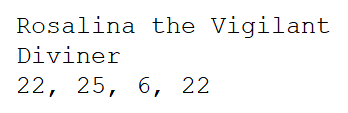
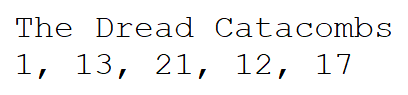

Introduction
============

This final lab is designed for you to create a program which can utilize
some past data structures to help the adventurers of the land of Trebor
become famed and experienced heroes.

In this lab you are expected to perform the basics of cloning your Lab
10 repository from the GitLab course group. A link to the course group
can be found
[here](https://git.cs.dal.ca/courses/2022-winter/csci-2122)
and your repository can be found in the Lab10 subgroup. See the Lab
Technical Document for more information on using git. You will notice
that your repository has a file in the **Lab10** directory named
**delete\_this\_file**. Due to the limitations of GitLab, we are not
able to push completely empty directories. Before you push your work to
your repository (which should be in the **Lab10** directory anyway),
make sure to first use the **git rm** command to remove the extra file.
If you do not, your pipeline could fail.

**Be sure to read this entire document before starting!**

Table of Contents
===============================

[[_TOC_]]

Foreword
========

In this lab you will be writing several program contracts, although
those contracts are much less structured than in previous labs. You are
free to write your code however you'd like, although you are still
required to adhere to the checklist found in the [Submission](#submission) 
section of this document. We recommend you look that over before you start 
coding so you know which requirements do exist.

While we do not have specific function requirements in the form of
function contracts, we do expect you to adhere to good code design:

1.  Include as many comments as necessary to make your code easy to
    understand.
2.  Create reasonably modular code and make functions for things you do
    repeatedly (initializations, common data manipulations, etc.).
3.  Split your code into multiple C source/header files and use a
    Makefile to compile them all together. Don't put all of your code
    into one giant file. This is inefficient and messy and you are
    likely to lose points if you do so.
4.  Remember that debugging tools can help you create better code by
    pointing out memory leaks or invalid reads/writes. Use them often to
    produce better code.

At the end of this lab you will be tasked with creating your own GitLab
pipeline scripts. You may find it easier to make these as you are coding
so you can stay on top of each thing you plan on testing. Feel free to
look at the GitLab pipeline scripts included in the previous labs (the
*.gitlab-ci.yml* file and the scripts in the *CI* directories). We will
briefly go through the anatomy of a pipeline job script in the
[Pipeline Scripts](#pipeline-scripts) section.

The Land of Trebor
==================

In the Land of Trebor you will find many kinds of adventurers, from the
aquamancers of the Southern Seas to the knights of the Halls of
Splendor. There are many perils throughout the lands, and it's your job
to help as many adventurers reach level 200 as possible.

In this lab, you will be given 300 heroes and 200 adventuring locations.
Heroes can start at any location you choose, but then are tasked with
moving from area to area, trying to overcome the challenges within. Once
an area is completed, the hero will gain a level and their attributes
will increase. If a hero is unable to complete a given area, they
perish, but their journey's end is recorded in the history books.

Heroes
------

A hero is a skilled adventurer trying to overcome the mystical
challenges of the world. All heroes contain the following vital
statistics:

1.  **Name**: Every hero needs a name. This will be used to
    differentiate heroes from each other because simply numbering them
    seems rude.
2.  **Class**: Every hero is given a class, which defines what their job
    is. Most jobs are assigned randomly, but a few rare jobs are
    assigned based on statistics.
3.  **Strength Attribute**: Some heroes are strong. They will do well in
    locations that need Power.
4.  **Agility Attribute**: Some heroes are fast. They will do well in
    locations that require Subtlety.
5.  **Intelligence Attribute**: Some heroes are smart. They will do well
    in locations which need Strategy.
6.  **Charisma Attribute**: Some heroes are smooth talkers. They will do
    well in locations which need Charm.
7.  **Level**: A hero's level determines how their attributes improve. A
    hero always starts at level 0. Get to level 200 and they'll go down
    in the history books as incredibly famous adventurers!

While you are free to code your program however you'd like, we recommend
creating a C struct for holding the various Hero information. You should
minimally have a field for each of the statistics mentioned above,
although if you think there should be more fields added (for your
convenience), feel free to do so. In this lab we will not restrict how
you write your code, although you should make sure your submission
matches the checklist in the [Submission](#submission) section.

This lab includes a file named **heroes.lot** which contains starting
statistics for 300 heroes. Each hero entry is stored in plain text in
the heroes.lot file and contains three lines. There will be 300 such
heroes stored one after another in the text file.

The first line in a hero's entry is a string representing their name.
The second line in a hero's entry is a string representing their class
name. The third line in a hero's entry is a comma-separated list of
numbers, which represent that hero's Strength, Agility, Intelligence,
and Charisma, in that order. These hero attributes start in the range
$[5, 25]$ and should increase over time based on their primary attribute
(see **Gaining Levels** below). The heroes in the .lot file are given in
no particular order.

For example:



In this entry we find the hero named "Rosalina the Vigilant". Her
class is \"Diviner\", which is a type of wizard that specializes in
divination magic, often letting them predict the future or see/hear
distant places. She has 22 Strength, 25 Agility, 6 Intelligence, and 22
Charisma. She's very good at most things, but apparently not very
studious. Seems backwards for a wizard, but who am I to judge? She might
become a great hero someday!

It's a good idea to read in the heroes.lot file and store all of that
hero information somewhere so you can use it while your program is
running. How you do this is completely up to you.

Locations
---------

A location is a dungeon or questing location where a hero can solve a
problem and earn some experience. In order for a hero to be legendary,
they must reach level 200. Each time a hero completes a location, they
gain one level. If they fail to complete a location, they die a heroic
death. How tragic! A location has the following vital statistics:

1.  **Name**: The name of the location. This is used to differentiate
    locations later.
2.  **Level**: The difficulty level the location was generated with.
    While this is generally a good indication of difficulty, there is
    some variance between location level and that location's difficulty
    ratings.
3.  **Power Rating**: The location's Power rating opposes a hero's
    Strength.
4.  **Subtlety Rating**: The location's Power rating opposes a hero's
    Agility.
5.  **Strategy Rating**: The location's Power rating opposes a hero's
    Intelligence.
6.  **Charm Rating**: The location's Power rating opposes a hero's
    Charisma.

While you are free to code your program however you like, similar to the
heroes, we recommend creating a C struct to hold Location information.
You may find this especially useful when working with threads with the
hero/location restrictions. See the [Challenging a Location](#challenging-a-location) 
section below.

This lab includes a file named **locations.lot** which contains the
statistics for each location you will be using in your simulations,
stored in plain text. Each location will be stored as two lines and
there are 200 such locations stored in the text file.

The first line in a location's entry is a string representing the
location's name. The second line of a location's entry is a
comma-separated list of numbers which represent that location's Level,
Power, Subtlety, Strategy, and Charm ratings, in that order. These
attributes could be any integer values, but the current locations.lot
file's ratings do not exceed 75. The locations in the .lot file are
given in no particular order.

For example:



In this entry we find a location named "The Dread Catacombs". This
location has a Level of 1, a Power Rating of 13, a Subtlety Rating of
21, a Strategy Rating of 12, and a Charm Rating of 17. This is a
somewhat average early location, where most heroes should be able to
challenge this location successfully.

Similar to the heroes file, it's a good idea to read in the
locations.lot file and store your locations in a place where they are
easily retrievable later.

Challenging a Location
----------------------

Now that you've read in and stored your heroes and locations, it's time
to consider what happens when a hero enters a location and attempts to
defeat any monsters and solve any puzzles inside. We won't make you work
that out on an individual basis, so instead we will abstract the
challenge that a location presents by breaking it down into a few
comparisons.

Whenever a hero attempts to challenge an area, you will compare the
hero's attributes to the difficulty ratings of the location. Consider
the following example with Rosalina and the Dread Catacombs:

| Rosalina the Vigilant | The Dread Catacombs |
| ------                | ------              |
| **Strength 22**       | 13 Power            |
| **Agility 25**        | 21 Subtlety         |
| Intelligence 6        | **12 Strategy**     |
| **Charisma 22**       | 17 Charm            |

When Rosalina challenges the Dread Catacombs, you perform the following
comparisons between the hero and the location: Strength vs. Power,
Agility vs. Subtlety, Intelligence vs. Strategy, Charisma vs. Charm. For
each comparison, if the hero's attribute is greater than or equal to the
corresponding location rating, then the hero wins that test. In the
above table, the bolded values are the winners of the comparisons. If
the hero wins **any tests** in the challenge, they have successfully
completed the challenge. They gain one level and then move to the next
location on their path. In Rosalina's case, she has a successful test of
Strength, Agility, and Charisma, so she gains a level and moves to the
next location.

If the hero does not manage to successfully win any tests, they perish
at this location. You should store which location the hero died in (for
use later), then add the hero's name to a list of all characters who
have died at this location.

**When a hero is challenging a location, no other hero is allowed to
challenge that location at the same time.** If a hero attempts to
challenge a location which is already being challenged, they must wait
until that location is free before they can start their challenge. You
may want to consider ways to keep other heroes from entering locations
they shouldn't, from the point of view of threads.

Gaining Levels
--------------

When a hero levels up, their level statistic should increase by 1. At
that point their attributes should be increased.

When a hero enters the world, they have some statistics based on the
**heroes.lot** file. Whatever their highest attribute is when they enter
play is considered their **primary attribute**. In the case of a tie,
choose their primary attribute in the order of Strength, Agility,
Intelligence, and then Charisma. For example, if a character has 22
Agility and Charisma, then Agility is their primary attribute.

A hero's primary attribute will improve faster than their other
attributes when they gain a level. Make sure you take note of each
character's primary attribute as necessary.

When a character gains a level, their primary attribute should increase
by 0.35 and all of their other attributes should increase by 0.25.
**This is simple addition and not multiplication**, so your heroes will
require their attributes to have the ability to store fractions. If you
multiply your attributes instead of adding to them, depending on how you
do it, you could end up with exponentially small or large attributes, so
be careful!

Running the Simulation
----------------------

In order to do any adventuring in the Land of Trebor, you will need to
follow the steps found here. Note that these steps are recommended as an
overarching design philosophy, but are not necessarily the only way to
do it. If you have a different strategy for solving the problems as they
have been laid out, feel free to attempt those instead.

This lab expects you to use a thread pool to send your adventurers out
into the world to go questing. This means only a certain number of
heroes will be adventuring at any given time. When an adventurer has
completed every location (and thus achieved level 200) or they have
died, they are removed from the thread pool and the next hero's
adventure begins. When all of the heroes' adventures have concluded, we
will then print some information about the simulation to the screen.
That said, the following sections will outline a reasonable order to
achieve success with this lab.

### Define your Structs

You should define any structs necessary to hold data. For us, this would
include an Args struct for holding any necessary thread input data, a
Hero struct for holding Hero information, and a Location struct for
holding Location information. The various structs could potentially hold
more than the fields explicitly outlined in the previous sections, such
as lists of names in the Location struct for dead heroes. It's always a
good idea to have a design in mind before you start coding.

### Decide on Preliminary Source and Header Files

Create C source files and header files for categories of data. For
example, it might be useful to have **heroes.c**, **locations.c**, and
**simulation.c** (along with their associated headers) to hold structs
and functions for the heroes, locations, and your main thread
pool/simulation logic.

### Decide on an Initial Design Flow

If you need to, draw on some paper how you imagine the interaction of
various pieces of code will occur, then create a list of functions which
will be capable of following those interactions. For example, if you
have to read in various pieces of data from a file, consider when that
will happen in the overall flow of your code. How will you handle
location ordering? Under which conditions will you decide when to create
a new thread for the pool, and when will that generally happen? Writing
some pseudo-code in comments to outline the steps and procedures of your
program before you write it can make your life significantly easier in
the long run.

### Create a Working Makefile

**This is not something to be left to the end!** This is what you should
do at the start, once you finalize which libraries and files you will
need to compile in order to reach the final executable file. Remember to
make object (.o) files for each of your source files, and use the **-g**
compiler option whenever you can in order to help with the debugging
process. It's also *extremely useful* to define a **clean** target in
your Makefile so you can remove any generated .o or executable files for
the next time you run **make**, which will then compile everything
completely from scratch. Be especially careful with what you put in your
**clean** target, as students have accidentally deleted entire Lab 10
directories before. The CS IT staff only back up the servers once per
day around 2am, so if you're not pushing to GitLab regularly (which you
should be doing, for backup purposes and regular testing), then you are
playing a dangerous game with fate.

### Create a Working GitLab Commit Script

One of the things that you may find useful for your project is to create
a bash script capable of using git add to stage all of the necessary
files, running a commit with a message (which you could accept as an
argument to the script), and then git pushing all of your changes. This
will save you from having to do all of these steps manually. If you use
git add on each file independently in your script, it will also stop you
from accidentally adding/pushing files that you don't want to exist in
your remote repository on GitLab. You can find a video about setting up
your repository in this fashion on Brightspace.

### Get One Hero Working without Threads

Start by reading in a single hero and a single location and write a
function for having a hero challenge a location. Get that working
perfectly. Once that's done, read in multiple locations and test your
hero against all of them.

### Repeat with Multiple Heroes

Once you have one hero working on many locations, try running different
heroes against the same locations and see if the results are as you
expect them to be. Getting multiple heroes working on a subset of
locations is a good starting point for threads.

### Attempt to Run Threads for Your Heroes

Next you can try creating a thread for each hero and see if they are
still able to execute properly. Don't run more than one thread at a time
until you're able to get the single threads working.

### Set Up Your Thread Pool

Once you have the hero threads working, you can start to build your
thread pool. Start with a small thread pool. You may find it useful to
accept a single command line argument (which will appear in argv in your
main function definition) to define the number of threads in your thread
pool. That way you can execute your program with `./programName N` to
tell your program to create a pool with N threads.

### Ensure Your Threads Aren't Racing

One of the problems with threads is that they can enter a race
condition, where two threads will operate on the same data and cause
that data's state to become unstable. We detailed how to avoid race
conditions and protect critical sections in Lab 9. You may need to treat
individual Locations as critical sections. Try not to make your
semaphores cover too much code. If your semaphores treat a very large
block of code as a critical section, it's going to stop threads from
operating in parallel. Pick reasonably sized critical sections and don't
protect code which is already thread safe.

For example, while you may want to lock each Location (so only one hero
can be inside each location at a time), be careful not to lock the
entire thread function (going to every location in a loop, for example)
because that means each hero will have to wait until the currently
executing hero finishes their adventure. It's much more efficient to let
heroes travel freely from location to location, only stopping if another
hero is currently challenging a location they want to enter.

### Collect and Print Required Information

Once your thread pool executes successfully and all of the threads have
been completed, you can collect and print any relevant statistics to the
screen, as defined by the contract you're currently working on.

Pipeline Scripts
================

Creating a pipeline script to run on GitLab is similar to writing a bash
script, with a few small bookkeeping changes, which will be outlined
below. When you push to GitLab and there is a pipeline script available,
GitLab will automatically attempt to execute that pipeline script to
completion by executing a series of **jobs**. The jobs are executed
based on the order defined by the pipeline system and (typically) the
current stage of the pipeline depends on the previous. This means you
can logically break your various jobs out into the individual stages and
ensure that everything runs in the appropriate order. While this is be
no means a comprehensive explanation of pipeline script files, it should
be more than enough to get you started with your own pipeline
executions.

We will start with an old pipeline script from Lab 8. This has since
been updated in the current version of course, but still serves as a
reasonable example for explaining how pipelines work. Every pipeline
script is stored in the root of your repository and must be named
**.gitlab-ci.yml** in order for GitLab to properly detect it. The script
can be seen here:

```python
# Robert Smith -- Check Lab 8 Code Outputs

stages:
	- setup
	- build
	- test

check-file-structure:
	stage: setup
	tags:
		- ugrad
	script:
		- test -d Lab8
		- test -d Lab8/birthday
		- test -d Lab8/heap
		- test -f Lab8/birthday/birthday_debug
		- test -f Lab8/heap/heap.c
		- test -f Lab8/heap/heap.h
		- test -f Lab8/heap/Makefile

run-birthday:
	stage: test
	tags:
		- ugrad
	script:
		- cp CI/objects/birthday/* Lab8/birthday/
		- cd Lab8/birthday/
		- test -f happy_birthday_geralt
		- test -f example_story_out
		- gdb -batch -x birthday_debug
		- ../../CI/compare-memory-outputs.sh

run-heap:
	stage: test
	tags:
		- ugrad
	script:
		- cp CI/objects/heap/* Lab8/heap/
		- cd Lab8/heap/
		- rm -f heap.o heap rheap
		- make
		- test -f heap.o
		- test -f heap
		- test -f rheap
		- ./heap
		- ./rheap
```

In the above script, we can see there are a few different keywords which
define different components of the pipeline script. To begin, for
consistency, we are defining three stages of testing and execution
(which we don't necessarily have to use all of, but can). We have used
them all at some point during the semester for our pipelines.

The **stages** of the pipeline execution flow are broken down into three
stages in this script: setup, build, and test. While these can be
expressive, they're also categorical labels and can be almost anything
you'd like. These three are simple and somewhat standard, so we continue
to use them. These stages will execute in the order presented here.
Notice that those lines begin with a **-**. This is the default way of
executing commands in your pipeline script.

Spacing in CI/CD files is very important and GitLab expects you to use
tabs (not multiple spaces) to indent things. If your text editor (vim)
is set to automatically convert tab spaces into multiple regular spaces,
you will need to turn off that functionality in order to properly edit
your pipeline scripts. The CI/CD section of GitLab has an editor built-in
which you can use to edit your pipeline scripts with proper format validation.

The rest of the script is broken down into **jobs**. Each job has some
parameters associated with it, followed by a script. The **stage**
parameter defines which stage this job should occur in. Jobs which occur
in the later defined stages are dependent on the previous stages to
complete, which means the only way the **build** stage is executed is if
every job in the **setup** stage passes successfully. Therefore, in this
case, we can see that **check-file-structure** must pass if we expect
the **run-birthday** or **run-heap** to begin. Jobs which are set to
execute in the same stage will usually execute in parallel, meaning they
are not dependent on each other to complete unless you specifically tell
them to.

The **tags** section of each job will tell GitLab which GitLab pipeline
runners (threads specifically for finding pending jobs and running them)
this pipeline is allowed to use. In the case of the CS GitLab server, we
will always tell it to use **ugrad** (undergraduate server) runners,
which will force the system to run our script on Timberlea (or Bluenose
in the case of a winterback situation). This will always need to be set
this way in your pipeline scripts or you may never get a runner.

Once your stage and tags are set, you can provide a **script** for the
runner to execute. This script is a list of Unix commands (similar to a
bash script file) and these commands will execute in order. The script
section is the main system which will cause your pipeline to reach a
Passed or Failure state. Each job's script is executed, one after the
the other. Every script command executes and GitLab waits to receive its
exit code. You may remember from previous labs that an exit code of 0 is
considered success. If every script command returns an exit code of 0,
then the entire job will pass. If the runner receives an exit code of
anything other than 0, it will immediately fail on that command, which
means none of the remaining script commands will execute.

Let's look at the **run-heap** job here:

```python
run-heap:
	stage: test
	tags:
		- ugrad
	script:
		- cp CI/objects/heap/* Lab8/heap/
		- cd Lab8/heap/
		- rm -f heap.o heap rheap
		- make
		- test -f heap.o
		- test -f heap
		- test -f rheap
		- ./heap
		- ./rheap
```

This job occurs during the test stage and executes with a ugrad runner.
Once a runner is found, it begins executing its script.

The pipeline begins execution at the root of the repository. At line 6
it copies all of the contents of the **CI/objects/heap** directory into
the **Lab8/heap** directory. This gives the heap contract code (and the
pipeline itself) access to any of the necessary object and output files
for testing purposes. At line 7, the pipeline changes its directory to
the **Lab8/heap** directory. At line 8 and 9, we force-remove the
required object and executable files for the heap, and then run **make**
to re-create those files. We then use the Unix test command to ensure
the **make** command has generated the **heap.o**, **heap**, and
**rheap** files on lines 10-12. Once we verify those files exist, we
execute heap on line 13, and rheap on line 14.

The **test** command is a Unix command which returns 0 if the file or
directory it's looking for exists. Setting the **-f** option tells it to
look for a file and the **-d** option tells it to look for a directory.
If the file or directory at the given path does not exist, it exits with
a 1, which will make the pipeline fail. In general, the test main
functions we provide for your programs will return a 0 on success and
some other positive number if they reach a fail state, which causes the
job (and thus the pipeline) to fail.

In this lab we will be asking you to create your own pipeline testing
scripts to ensure everything is being produced the way you expect it. It
could be worthwhile to look back through the various lab repositories to
see how the other *.gitlab-ci.yml* files were written so you can have
some better insight into how to create your own pipeline scripts. You
may also find it useful to produce expected outputs and compare them.
There are several recent labs which have compared output files. You may
also find it useful to check those script files to see how the
comparison is performed. Lab 8's Birthday contract specifically compares
story files and may be a good reference.

Lab 10 Function Contracts
=========================

In this lab you will be responsible for fulfilling two lab contracts:
the **Adventure** contract and the **Deus Ex** contract. Each contract
is designed to test you on some of the things you've learned throughout
the instruction portion of this lab.

For those of you who are concerned, when deciding which naming
conventions you want to use in your code, favour consistency in style,
not dedication to a style that doesn't work.

The contracts in this document are worth the following points values,
for a total of 10.

| Contract  | Points |
| ------    | ------ |
| Adventure | 6      |
| Deus Ex   | 4      |
| **Total** | **10** |

Adventure
---------

### Problem

You will write a program that will simulate hero adventures in a variety
of configurations.

### Preconditions

You are required to complete a program which:

1.  Is capable of handling Heroes as outlined in the [Heroes](#heroes) section.
2.  Is capable of handling Locations as outlined in the **Locations**
    section.
3.  Is capable of having a hero challenge a location as outlined in the
    [Challenge a Location](#challenge-a-location) section.
4.  Is capable of executing each hero's adventure in a thread pool.
5.  Is capable of outputting the information in the 
	[Postconditions](#postconditions) section.

Your program should read in the heroes and locations from the
**heroes.lot** and **locations.lot** files. Once this is done, you can
run a thread pool of hero adventures until all of the adventures have
concluded. Once the adventures have concluded, print the desired outputs
to the screen.

A single thread in this contract is considered a full adventure for a
single hero. The adventure is defined by some collection of locations
that the given hero must attempt to challenge, one after the other, in
order. If the hero is successful, they will reach level 200 after
completion of the final location on their path.

An adventure path is a series of locations in a specific order. For this
contract you will be required to run programs which test each hero
against paths created such that they are in the following orders:

1.  **Level Path**: Locations should be ordered by Level, from smallest
    level to largest.
2.  **Power Path**: Locations should be ordered by Power rating, from
    smallest rating to largest.
3.  **Subtlety Path**: Locations should be ordered by Subtlety rating,
    from smallest rating to largest.
4.  **Strategy Path**: Locations should be ordered by Strategy rating,
    from smallest rating to largest.
5.  **Charm Path**: Locations should be ordered by Charm rating, from
    smallest rating to largest.

You may perform all paths in a single program or in multiple programs,
although if you do them all in a single program make sure you don't mix
the path executions accidentally. Your heroes should all run the same
path before you print the final outcomes. You should also be careful not
to mix the results of the adventure paths. For example, you shouldn't be
printing hero A's Strategy path outcomes with hero B's Power path
outcomes.

Note that using a heap can be a useful method for sorting things,
assuming you construct the proper **compare** function. Recall that we
get a min-heap if our **compare(A, B)** function is always returning
negative integers when B $<$ A. You can use this to your advantage to
write compare functions for your heaps which are capable of creating the
paths mentioned above.

### Postconditions

Your programs should be capable of creating and executing threads. All
of the functions should be capable of executing without crashing.

Your program(s) should produce two files for each path:
**PathName\_alive** and **PathName\_dead**, where **PathName** is the
name of the path which was executed (**level**, **power**, **subtlety**,
**strategy**, **charm**). Both files should contain a list of heroes,
one hero per line. You may find it necessary to sort your files for the
purposes of testing with your pipeline, as threads will often execute
out of order between multiple runs, thus executing the various heroes'
adventures slightly differently each time. In the **alive** file you can
include the hero's name, followed by each of their attributes in the
order of Strength, Agility, Intelligence, Charm:

`Rosalina the Vigilant 92 95 76 92`

In the **dead** file, you should include the same information, but
additionally on each line you should include the level the character was
at their death, and the location in which they died:

`Rosalina the Vigilant 22 25 6 22 0 The Dread Catacombs`

The above outputs are just examples and may not necessarily reflect the
actual outputs, but should reflect the formatting. If you use floating
point values, your outputs may be slightly different, but still valid.

The last test you should perform is to choose one of your paths and
execute it with different sized thread pools. Execute your simluation on
a single path for all thread pool sizes in [1, 10] and time each
simulation. You may use the **gettimeofday()** function from the
**sys/time.h** library, which can provide you with microsecond times
(Google and **man** are your friend here). Print the time taken for each
simulation in microseconds to the screen.

The heroes.lot and locations.lot files, which contain the heroes and
locations data, can be found in **CI/objects/adventure**.

### Restrictions

None.

### File Requirements

Your header files should contain your forward declarations, struct
definitions and typedefs, as well as any library imports (includes) you
may need. Always protect your headers with a define guard. **You will
need to write a main function for each program you provide**, as well as
a Makefile which successfully compiles all of your code. We recommend
setting up a single C source file for holding your main function. This
is useful for testing, as it means you can have multiple main function
files and can adjust your Makefile to compile whichever ones you'd like.
You are also required to provide a .gitlab-ci.yml file so your code is
properly tested in a pipeline of your own design.

Your source files, header files, and makefile should be placed in the
**Lab10/adventure/** directory in your GitLab repository. Also be sure
to include any libraries you need from previous labs or solutions.

### Testing

To test your code, you should create a pipeline file. Create any
necessary expected outputs for your programs and store them in
**CI/objects/adventure** directory. When your pipeline executes, copy
the objects directory contents into your contract directory, remove any
executable and .o files, then run make. Next, test to ensure your
executable and .o files exist (library .o files do not need to be
checked). If successful, execute your programs, being careful to store
any outputs in new files, then run your comparisons against expected
output. If your comparisons are successful, your pipeline should pass.

### Sample Inputs and Outputs

None.

Deus Ex
-------

### Problem

You will write a program that will simulate hero adventures in specific
configurations.

### Preconditions

Make a copy of your Adventure contract program and modify it so that
each hero executes using an adventure path which allows them to reach
their highest potential level. You may use the results of the previous
contract to decide how to approach selecting the correct path for each
hero, however you are not allowed to specifically select the best path
for each hero by name or class. You must use the hero's attributes in
some fashion to decide which path they should take.

The heroes.lot and locations.lot files, which contain the heroes and
locations data, can be found in **CI/objects/adventure**.

### Postconditions

Your programs should be capable of creating and executing threads. All
of the functions should be capable of executing without crashing.

Your program should produce two files: **deusex\_alive** and
**deusex\_dead**. Both files should contain a list of heroes, one hero
per line. You may find it necessary to sort your files for the purposes
of testing with your pipeline, as threads will often execute out of
order between multiple runs, thus executing the various heroes'
adventures slightly differently each time. In the **alive** file you can
include the hero's name, followed by each of their attributes in the
order of Strength, Agility, Intelligence, Charm:

`Rosalina the Vigilant 92 95 76 92`

In the **dead** file, you should include the same information, but
additionally on each line you should include the level the character was
at their death, and the location in which they died:

`Rosalina the Vigilant 22 25 6 22 0 The Dread Catacombs`

The above outputs are just examples and may not necessarily reflect the
actual outputs, but should reflect the formatting. If you use floating
point values, your outputs may be slightly different, but still valid.

Unlike the Adventure contract, you do not have to time this result.

### Restrictions

None.

### File Requirements

Your header files should contain your forward declarations, struct
definitions and typedefs, as well as any library imports (includes) you
may need. Always protect your headers with a define guard. **You will
need to write a main function for each program you provide**, as well as
a Makefile which successfully compiles all of your code. We recommend
setting up a single C source file for holding your main function. This
is useful for testing, as it means you can have multiple main function
files and can adjust your Makefile to compile whichever ones you'd like.
You are also required to provide a .gitlab-ci.yml file so your code is
properly tested in a pipeline of your own design.

Your source files, header files, and makefile should be placed in the
**Lab10/deusex/** directory in your GitLab repository. Also be sure to
include any libraries you need from previous labs or solutions.

### Testing

To test your code, you should create a pipeline file. Create any
necessary expected outputs for your programs and store them in
**CI/objects/deusex** directory. When your pipeline executes, copy the
objects directory contents into your contract directory, remove any
executables and .o files, then run make. Next, test to ensure your
executable and .o files exist (library .o files do not need to be
checked). If successful, execute your programs, being careful to store
any outputs in new files, then run your comparisons against expected
output. If your comparisons are successful, your pipeline should pass.

### Sample Inputs and Outputs

None.

Submission
==========

Marking Method
--------------

Unlike previous labs, this lab will be marked by human markers, and thus
it is possible for you to receive partial points, as outlined below.

Required Files
--------------

Each file must be contained in the directory listed in the structure
requirement diagram below. These files include:

1.  Makefile (for adventure)
2.  Makefile (for deusex)

**These files are the minimum required and will not be tested for with a
script, but if they do not exist you will receive a 0**. You may submit
other files that your Makefile needs to function correctly. Any
additional files will not count against you. Be careful with what you
upload, as it could cause issues with your pipeline (such as hiding
changes from your Makefile). You should try your best to only push the
files your program needs to compile and execute.

Submission Procedure and Expectations
-------------------------------------

Your code will be submitted to your Lab 10 GitLab repository using the
same method as outlined in the Lab Technical Document. Refer to that
document if you do not remember how to submit files via the GitLab
service. A link to your repository can be found in the **Lab10**
subgroup of the CSCI 2122 GitLab group
[here](https://git.cs.dal.ca/courses/2022-winter/csci-2122).

Submission Structure
--------------------

In order for a submission to be considered valid, and thus gradable,
your git repository must contain directories and files in the following
structure:

```
Lab10/
 ┣ adventure/
 ┃  ┗ Makefile
 ┗ deusex/
    ┗ Makefile
```

As with all labs, accuracy is incredibly important. When submitting any
code for labs in this class, you *must* adhere to the directory
structure and naming requirements in the above diagram. Failure to do so
will yield a mark of 0. That said, in this lab, your directory structure
requirement is to *minimally* have these files, but you may have more as
you require.

Remember to remove **Lab10/delete\_this\_file** from your repository
using **git rm** to avoid any pipeline failures.

Marks
-----

This lab is marked out of 10 points. All of the marks in this lab are
based on the successful execution of each contract. Any marking pipeline
failures of a given contract will result in a mark of 0 for that
contract. Successful completion of the various contracts will award
points based on the following table:

| Contract  | Points |
| ------    | ------ |
| Adventure | 6      |
| Deus Ex   | 4      |
| **Total** | **10** |

Since this lab has an open requirement for code, the marks for each
section are found below. Each mark builds on the previous (even across
contracts), meaning that you will only receive marks in order from 
top-to-bottom until a requirement is not met, at which point the marking 
for the current contract will stop.

### Adventure (6 points)

1.  Create a working Makefile (0.25 points)
2.  Read in Hero and Location data (0.25 points)
3.  Generate all required paths (0.5 points)
4.  Complete at least one path without threads (0.5 points) **OR**
    Complete all paths with threads (2 points)
5.  Produce all required output files and times for all paths (2 points)
6.  Properly evaluate (fully) completed code with a pipeline script (1
    point)

### Deus Ex (4 points)

1.  Create a copy of the Adventure code for modification (0 points)
2.  Create a working Makefile (0.25 points)
3.  Ensure each hero is given the optimal path from the generated list
    (1 point)
4.  Execute all adventure paths successfully (1 point)
5.  Produce required output file for the chosen path (1 point)
6.  Properly evaluate (fully) completed code with a pipeline script
    (0.75 points)

**Note: creating a working Makefile means it must actually produce code
for the subsequent requirements. You will not receive points for a
Makefile which technically runs, but does not actually produce any
working code.**
